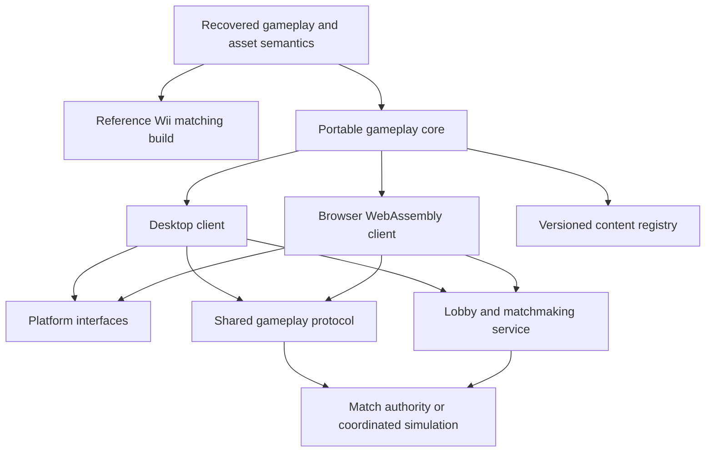

# Future Brawl desktop/browser and expanded-content roadmap

Updated September 30, 2026. This adds the user's long-term product direction to the matching-decompilation plan. Codex plans; Claude implements. No port, backend or multiplayer changes are authorized by this document alone beyond the implementation scope the user gives Claude.

## Intended product

Run Brawl locally as a desktop application and locally inside a browser, with shared gameplay behavior and compatible online play. Expand beyond the original console's constraints: larger online communities/lobbies, experimentally larger battles, and custom characters/content. Browser execution should run the game on the user's device; cloud-streaming gameplay would be a different product.

Preserve a reference matching build alongside an enhanced host build. The reference reproduces original executables and is the behavioral oracle. The enhanced build intentionally changes limits/features and requires its own tests; its modified binaries cannot satisfy the original matching hashes.

Do not require 100% matching decompilation before researching or prototyping a portable recovered subsystem. However, original PowerPC fallback objects cannot be linked directly into a native or WebAssembly build. Each runnable port slice needs recovered source or an explicit emulation/recompilation solution for all dependencies it executes.

## Halo reference: verified facts and limits

Reference supplied by the user: [Halo browser site](https://halo-web.otherness-bugs.workers.dev/). The screenshot shows a room counter of 1/128. Static page inspection found an Emscripten runtime integration, a `halo.js` script, browser capability checks, a signaling service URL, and links to the Halo universal-port repositories. These are observations of the page delivered today, not proof of its complete rendering/network architecture or capacity under load.

The linked [Halo universal-port repository](https://github.com/cybersecurity/halo-ce-universal) documents a decompilation-derived desktop/Android port, up to 128 players across 128 machines, and new netcode with local immediate movement and host game authority. It is a useful example of recovered game code followed by platform and networking work. Its stated limit is **up to 128**, not verified support beyond 128. Neither 128-player gameplay nor sustained browser performance was tested here.

Transfer the architectural idea, not the numerical claim. A shooter's networking/simulation tradeoffs do not establish a suitable design or fighter capacity for Brawl.

## Three independently measured capacities

| Capacity | Meaning | Design direction |
|---|---|---|
| Lobby participants | People in a room, including waiting players and spectators | Scalable room service, invitations, readiness and matchmaking |
| Simultaneous matches | Multiple battles organized by that room | Each battle has independent simulation and player/spectator membership |
| Active fighters per battle | Fighters actually simulated in one arena | Explicit engine-limit audit and staged gameplay experiments |

A large lobby can be useful before large-arena battles work: rotating opponents, tournaments, spectators and several concurrent matches. Never advertise a lobby connection count as a demonstrated simultaneous fighter count. Do not adopt 128 fighters as a committed target without a measured prototype.

## Proposed architecture

Start with a modest set of explicit interfaces around renderer, input, sound, filesystem/assets, memory, clocks, scheduling and network transport. Avoid rewriting all game systems into a new framework. Preserve tested recovered behavior until a specific port limitation demands a change.

The browser candidate is Emscripten/WebAssembly. Choose the rendering backend after a GX-state prototype and browser capability measurements; investigate WebGL2 and WebGPU rather than assuming either makes GX translation automatic. Desktop and browser must share asset decoding, gameplay semantics, protocol and content identities even if platform backends differ.

Browser networking needs an adapter: ordinary raw TCP/UDP sockets are unavailable to pages; WebSockets, WebRTC data channels or WebTransport have different delivery/compatibility properties. Select match transport through loss/latency testing, separate from room signaling. See [Emscripten networking](https://emscripten.org/docs/porting/networking.html).

Browser threading also needs explicit deployment/runtime design. Emscripten pthread builds require shared memory and appropriate cross-origin isolation; blocking the browser main thread is problematic. Decide whether separate threaded/nonthreaded builds are needed after capability tests. See [Emscripten pthread support](https://emscripten.org/docs/porting/pthreads.html). Do not copy Wii thread assumptions into a browser loop unchanged.

## Multiplayer design study

For ordinary fighting-game matches, investigate deterministic simulation with input prediction and rollback first. This is a proposal, not a claim that current Brawl state can already be rolled back. Audit RNG, floating-point results, event ordering, mutable state and resource handles. Save/restore must capture every gameplay-relevant state dependency. Hash a canonical serialized state, not platform-dependent struct memory.

Compare that design against an authoritative host/server with prediction and corrections for larger experimental battles. Fix authority for outcomes, validate player inputs, define disconnect/rejoin and spectator behavior, and specify protocol/build compatibility. Do not combine two authority models casually; document which mode uses which rules and why.

Avoid a peer-to-peer full mesh as the default large-room design. Lobby members should not all exchange simulation traffic merely because they share a room. A signaling service is not automatically a simulation server; choose simulation hosting after CPU and bandwidth measurements.

Acceptance evidence needs desktop↔desktop, browser↔browser and desktop↔browser tests; seeded replays; artificial delay, jitter, loss and disconnects; state divergence detection; correction/rollback costs; and sustained frame-time/bandwidth measurements. Start with two players, then the original-sized match, before trying expanded battles.

## Removing active-fighter limits

Before changing a maximum-player constant, produce a limit map with source location, evidence and dependent consumers. Audit:

- Fighter/controller/team identifiers, fixed arrays, bitmasks and allocation pools.
- Spawn selection, camera framing, HUD/results, targeting and stage scripts.
- Collision broad phase, hit tracking, effects/projectiles, audio voices and render load.
- Input packets, synchronization state, replay/save formats and ownership tables.
- Assumptions embedded in custom or original character scripts and assets.

Increasing a constant without tracing consumers can leave hidden limits intact. Refactor one proven limit at a time in the enhanced build. Measure collision cost with realistic attacks and objects; pairwise interactions can grow much faster than participant count. Use successive experimental capacities, such as 8 then 16 fighters, only when each prior stage passes gameplay and performance criteria. Numbers here are experiment sizes, not promised release limits.

## Custom character/content contract

Plan a registry with stable namespaced character IDs rather than assuming a fixed original roster. Each content package should declare a schema version, content hash, dependencies, model/rig/material/animation resources, collision and move data, scripts/behavior interfaces, audio/effects and UI assets.

First reproduce an original character through the proposed package pipeline. Then add a simple custom character without modifying the central roster loader. Validate the full lifecycle: selection, loading, spawning, gameplay, results, replay and unload.

Desktop and browser participants in a match need compatible versions of gameplay-affecting packages. Room/match setup should compare content fingerprints before play. Separate cosmetic differences from gameplay changes only after defining that boundary precisely. Store character IDs and package versions in replays.

Investigate data-driven behaviors and a bounded scripting interface for portable extensions. A Wii REL or native desktop plugin is not automatically a browser-compatible character plugin. If arbitrary new native behaviors are supported, define a separate build/distribution model for each target rather than implying one binary plugin works everywhere.

## Milestones for Claude's later implementation

| Milestone | Concrete pass condition |
|---|---|
| P0 source progress | Continue small unimplemented TUs; preserve all matching checks |
| P1 limit/platform maps | Document actual fighter-limit consumers and platform dependencies |
| P2 desktop vertical slice | One stage and recovered fighter dependencies run with measurable reference behavior |
| P3 browser vertical slice | Same slice runs locally in browser with input/audio/assets and acceptable measured frame time |
| P4 shared online match | Two clients across desktop/browser stay synchronized under network impairments |
| P5 custom content | Add a character through the package contract; compatibility/replay checks pass |
| P6 larger rooms | Room service supports measured memberships and independent match instances |
| P7 larger battles | Incremental fighter expansions pass engine, networking and performance tests |

Port feasibility research can proceed alongside matching work; it should not derail that work into a premature backend/renderer rewrite. Before implementation of P2+, write a dependency-closure plan showing exactly what source is available and what remains unavailable.

## Current handoff status

The user relayed Claude's report that `cm_controller_menu_fixed.cpp` fully source-matches, is committed, and all 127 binaries pass. Claude also reported existing upstream matches for the utRelocate destructor, mtSinf and scheduler create. Those are reported results, not independently revalidated by Codex in this update.

The current instruction remains: new small TUs first; save difficult register-allocation attempts; reassess one bounded permuter experiment after three further complete TU matches. The future port direction adds research priorities; it does not require Claude to restart the baseline or immediately build multiplayer infrastructure.
