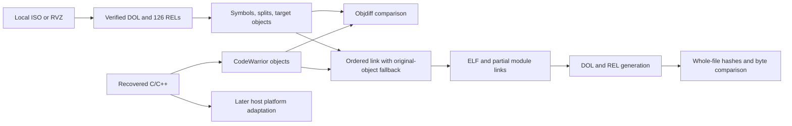

# Brawl matching decompilation: implementation specification for Claude

Prepared September 30, 2026 as the initial research handoff. The user subsequently authorized Codex to implement directly. For completed implementation and fresh build verification, read `CODEX_RESUME.md` and the repo's `docs/RSBE01_01.md`. The original phase descriptions below remain the architectural baseline.

## Decision and scope

Extend the existing [doldecomp/brawl project](https://github.com/doldecomp/brawl), pinned to commit `f168bd99c35f4204d615d68a834cd6ca376495b9`. Its documented supported release is `RSBE01_02`. Our actual files are `RSBE01_01`. Add revision-1 support rather than inventing an independent framework. An accepted version name in argparse does not mean its binary configuration exists or is supported.

Build two distinct products over time:

1. **Matching reconstruction:** CodeWarrior builds PowerPC DOL/REL files identical to the local originals. Preserve the Wii ABI, executable layout and all data. Unimplemented units initially remain extracted objects.
2. **Native port:** a later host build replaces platform dependencies and adapts address/asset/graphics semantics. A matching DOL alone does not execute natively on x86-64 or ARM64. Define supported platforms individually; “any device” is an aspiration, not a testable acceptance criterion.

For the first product, success means separate measures for binary reproduction and source replacement. A rebuild using original objects can be byte-identical with almost no game code decompiled. Never call that a completed decompilation.



## Local evidence and target identity

Evidence: `reports/iso-disc-info.txt`, `reports/rvz-disc-info.txt`, `reports/dol-info.txt`, and `reports/binary-manifest.json`. These observations were measured from the supplied files, not inferred from filenames.

| Property | Observed value |
|---|---|
| ISO | `Super Smash Bros. Brawl.iso`, 8,511,160,320 bytes |
| RVZ | `Super Smash Bros. Brawl.rvz`, 6,072,787,548 bytes |
| Game ID and revision | RSBE01, header revision 1; project key RSBE01_01 |
| Main gameplay partition | partition index 1, type Data |
| DOL size | 4,817,568 bytes |
| DOL entry | 0x8000403C |
| DOL SHA-1 | `2a78a0b3f375bfc85c7e42e20bc8551d1492d5d8` |
| DOL MD5 | `2a9d97709d91bbdb8b3b6b20030b683b` |
| DOL SHA-256 | `179574a14c484279efef84db58e55fe31bc2e3cf6c99efc0d20e7b322ec088be` |
| ISO/RVZ executable comparison | all 127 extracted files byte-identical |
| REL comparison to pinned upstream | all 126 SHA-1 values identical to Rev2 manifest |
| DOL comparison to pinned upstream | differs; upstream SHA-1 is `a09cb9af20ae8356396374c27e31883d893f9ebe` |

The latter checksum is verified from the pinned [upstream binary configuration](https://github.com/doldecomp/brawl/blob/f168bd99c35f4204d615d68a834cd6ca376495b9/config/RSBE01_02/config.yml). Matching REL hashes permit reuse of REL symbols/splits. They do not establish that DOL addresses or layouts can be copied unchanged. No Rev2 DOL was available for a direct byte-range comparison.

Both images expose 14 partitions: one update partition, one main Data partition, and 12 other partitions. The initial target is the gameplay Data partition. Apploader reconstruction, update software and the other partitions are outside the initial match scope. If whole-disc reproduction is later requested, explicitly inventory their executable content too.

The entire ISO and reconstructed RVZ disc were not hashed or Redump-verified. “Lossless: true” from dtk describes format handling, not proof of an authentic unmodified dump. Current measured identity is the 127 gameplay executable files.

## Phase 1: extraction and binary inventory

### Recommended CLI: dtk VFS

Research used the official Windows x86-64 dtk 1.8.4 release, commit `a0c455e46cab58e1d2e0885623f85089ff0499db`. Local executable: `research/tools/dtk.exe`; measured SHA-256: `6a693e95aa4d30acccc673343302a4abdfa3146bd0fb15cb1a2bce924cbc782a`. Record release plus file hash; this is an observed hash, not an independent signature.

Run these commands from the workspace root. The selective extraction below has already been performed under `research/local/iso` and `research/local/rvz`. Claude should place equivalent originals in the eventual project's `orig` tree.

```powershell
.\research\tools\dtk.exe disc info "Super Smash Bros. Brawl.iso"
.\research\tools\dtk.exe vfs ls -r "Super Smash Bros. Brawl.iso:"
.\research\tools\dtk.exe vfs cp --no-decompress "Super Smash Bros. Brawl.iso:sys/main.dol" "orig/RSBE01_01/sys/main.dol"
.\research\tools\dtk.exe vfs cp --no-decompress "Super Smash Bros. Brawl.iso:files/module" "orig/RSBE01_01/files/module"
```

Substitute `.rvz` in each input to read RVZ directly; no conversion is necessary. Preserve raw target bytes with `--no-decompress`. A full raw asset extraction is:

```powershell
.\research\tools\dtk.exe disc extract "Super Smash Bros. Brawl.rvz" "orig/RSBE01_01"
```

The default is the main Data partition. Use `-p all` only for deliberately broader partition research. VFS extraction is useful for obtaining only build inputs and leaving bulk assets in the image. These capabilities are documented in [dtk](https://github.com/encounter/decomp-toolkit); command syntax was also checked against the downloaded executable's help.

### Dolphin alternative

GUI: add the image to Dolphin's game list, open Properties → Filesystem, select Data Partition → Extract Entire Partition. Verify that the output contains `sys/main.dol` and `files/module/*.rel` before accepting it.

The current DolphinTool CLI documents:

```powershell
DolphinTool.exe extract -i "Super Smash Bros. Brawl.rvz" -o "orig/RSBE01_01" -g
```

Check that installed release's `extract --help` first; older releases may differ. `-g` selects the Data partition. If conversion is needed for another tool, use `DolphinTool.exe convert -i "Super Smash Bros. Brawl.rvz" -o "converted.iso" -f iso`; use a new filename. See the official [DolphinTool usage](https://github.com/dolphin-emu/dolphin/blob/master/Readme.md#dolphintool-usage).

### Wiimms ISO Tools alternative

For the already available ISO:

```powershell
wit extract "Super Smash Bros. Brawl.iso" "orig/RSBE01_01" --psel DATA --pmode NONE
```

Partition selection and path prefixing are documented by [WIT extract](https://wit.wiimm.de/wit/cmd-extract.html). Use ISO for this route; RVZ support is not assumed. Preserve the directory hierarchy. Do not apply WIT patching, scrubbing or `--flat` to the matching inputs.

### Complete gameplay executable catalog

`reports/binary-catalog.csv` and `reports/binary-manifest.json` enumerate all 127 targets, including exact sizes and SHA-1/MD5/SHA-256. REL entries include module ID, version, section count, BSS size, entry-point section/offset pairs, and imported module IDs. All module IDs are unique; every import ID is either 0 (main) or another inventoried REL.

| Executable group | Count | Responsibility |
|---|---:|---|
| sys/main.dol | 1 | Resident engine, shared game and library code |
| ft_*.rel | 36 | Fighter modules, including grouped fighter implementations |
| st_*.rel | 49 | Stages plus special-purpose stage implementations |
| sora_menu_*.rel | 24 | Menus, selection, result and related UI |
| sora_adv_menu_*.rel, sora_adv_stage.rel, sora_enemy.rel | 14 | Adventure menus, stage and enemy logic |
| sora_scene.rel, sora_melee.rel, sora_minigame.rel | 3 | Scene and mode-level systems |

Full names are in `BINARY_CATALOG.md`; machine-readable catalog rows are authoritative. There is no assumption of one REL per playable fighter. For example, the observed files are `ft_poke.rel`, `ft_zelda.rel` and `ft_iceclimber.rel`, not a fabricated roster of individual character modules.

Asset preservation is separate: retain PAC/PCS archives, BRRES resources, sound archives/streams and movies in original form. Fighter scripts, tables and parameters can control behavior outside C++ functions. A REL match does not reconstruct those assets. Do not assume PAC archives are standard U8 or RARC containers; choose parsing by measured magic/format.

## Phase 2: repository and build toolchain

### Layout Claude should establish

```text
project/
  configure.py                         version/object/compiler policy
  tools/                               pinned upstream generator and utilities
  tools/verify_manifest.py              Claude implements strict local verification
  src/sora/{gf,mt,ut,ft,gr,ac,cm,if,...}/
  src/mo_fighter/<module>/
  src/mo_stage/<module>/
  src/mo_enemy/<module>/
  include/lib/BrawlHeaders/             pinned recursive submodule
  config/RSBE01_01/{config.yml,symbols.txt,splits.txt,build.sha1}
  config/RSBE01_01/rels/<module>/{symbols.txt,splits.txt}
  config/RSBE01_02/                     upstream support retained
  orig/RSBE01_01/sys/main.dol            private local input
  orig/RSBE01_01/files/module/*.rel      private local inputs
  docs/                                architecture and matching evidence
  build/RSBE01_01/                      generated, private
  objdiff.json                         generated
  build.ninja                          generated
  port/                                future host work, separate build policy
```

Do not move the existing root images automatically. Extract only required inputs or use one explicit image under `object_base`. Avoid putting two images in the same autodetected original directory. Original files, generated assembly/objects/binaries, assets and compiler executables stay out of the source repository. Research artifacts here contain local extracted originals and must also stay private.

Use pinned upstream [tools/project.py](https://github.com/doldecomp/brawl/blob/f168bd99c35f4204d615d68a834cd6ca376495b9/tools/project.py) to generate Ninja and objdiff configuration. Implement game/version choices in configure.py. Preserve response files, dependency conversion, Shift-JIS support, ordered linking, regeneration, and REL creation; a short handwritten Ninja file is insufficient.

### Compiler requirements and host execution

The executable is normally named `mwcceppc.exe` (note the spelling), with `mwldeppc.exe` as linker. Begin with upstream's `GC/3.0a5.2` toolchain family; a Wii title need not use a compiler package labeled Wii. Preserve the matching compiler and linker bytes and record their hashes locally. Modern GCC/Clang are useful for a future host build, not substitutes for a matching compiler.

Windows: native Python, Ninja and the Win32 compiler executables. No WSL requirement. Linux/macOS: use the wrapper supported by the pinned project and host architecture. The pinned project uses wibo on its supported x86 Linux route and documents Wine for other routes. Newer [wibo](https://github.com/encounter/wibo) and [template dependencies](https://github.com/encounter/dtk-template/blob/main/docs/dependencies.md) differ; changing wrapper policy is an explicit upgrade requiring regression builds. Do not assume a 32-bit x86 executable runs directly on ARM64.

Initial tool pins from upstream: binutils `2.42-1`, compiler archive `20250812`, dtk `v1.7.5`, objdiff `v3.4.4`, sjiswrap `v1.2.2`, wibo `1.0.0`. Keep these for first build reproduction. The newer research dtk must not silently replace the build pin. All tool archives need recorded hashes and controlled retrieval. Compiler availability and full build were not tested during research.

Native Python 3.13.14 and Git 2.53.0 were observed here; Ninja, DolphinTool and WIT were not found on PATH. No compiler installation was performed. Pin a tested Python version for CI instead of extrapolating from the local interpreter.

### Revision-1 configuration contract

Configuration should use the local hash and generate full analysis initially:

```yaml
object_base: orig/RSBE01_01
object: sys/main.dol
hash: 2a78a0b3f375bfc85c7e42e20bc8551d1492d5d8
symbols: config/RSBE01_01/symbols.txt
splits: config/RSBE01_01/splits.txt
mw_comment_version: 14
quick_analysis: false
write_asm: true
```

Add all 126 module entries using their measured hashes and copied REL configurations. Set per-module links or force-active behavior according to upstream, not by guess. Paths may point at shared identical REL symbol/split files if the generator supports it, otherwise use an explicit copied version tree. Keep a provenance record for each migrated DOL range.

This uses the [template configuration schema](https://github.com/encounter/dtk-template/blob/main/config/GAMEID/config.example.yml). Switch `quick_analysis` on only after stable symbol and split generation. Preserve gaps and any necessary force-active objects; do not clean exception-table padding or change the original checksum to make a rebuild pass.

### Headers

Use the existing BrawlHeaders submodule pinned by upstream: `e1c66b35eeeea6e8993633f823246df1611f6e2d`, with its recursive dependencies. [BrawlHeaders](https://github.com/Sammi-Husky/BrawlHeaders) targets MWCC and supplies game and middleware interfaces. A documented declaration is a starting hypothesis, not proof of target class layout. Verify size, offsets, inheritance, vtables, enum storage, bitfield layout and signedness against assembly.

Do not update the entire header dependency to fix one function. Record a local layout correction and check every dependent translation unit. Matching code follows the supported Metrowerks C/C++ dialect; avoid modern C++ features in matching TUs.

## Phase 3: disassembly, control flow and splitting

### Processor and loader setup

Use Ghidra plus [Cuyler36's GameCube loader](https://github.com/Cuyler36/Ghidra-GameCube-Loader), which supports DOL and REL loading. Select its 32-bit big-endian Gekko/Broadway PowerPC variant. The [language extension](https://github.com/aldelaro5/ghidra-gekko-broadway-lang) handles paired-single operations; generic PPC750 coverage alone is insufficient. Pin compatible Ghidra/extension versions after a loader smoke test rather than assuming the latest pair works.

Load the DOL using its header, not as a flat byte stream. Check entry point `0x8000403C`, map initialized segments to their header addresses, and create zero-initialized BSS separately. Recover r2/r13 small-data bases from startup and maintain their context during analysis. Establish code/data boundaries before recursive analysis; mark jump tables, literal pools and vtables as data. Do not treat every pointer-looking word as a relocation.

For RELs retain original section indices, executable bits, import tables and section-relative offsets. Module 0 references refer to the DOL. Resolve imports using the module-ID catalog. Mark prolog, epilog and unresolved handlers with their section indices; offset zero can be a real entry. Any synthetic RAM base used for analysis is not a runtime-address guarantee.

For combined analysis use `dtk rel merge main.dol module.rel -o merged.elf`, then select the Broadway language for the ELF. Maintain separate modules/namespaces when names collide. The installed CLI confirms `rel merge`; a README example uses `rel info` incorrectly, so CLI help wins.

IDA alternative: PowerPC, 32-bit, big endian, with DOL/REL loaders that preserve the same layout. [heinermann's loaders](https://github.com/heinermann/ida-wii-loaders) target the old IDA 6.1 SDK; adapting them to modern IDA is a separate task. Do not promise current compatibility. Validate paired-single instruction decoding with known byte sequences before trusting pseudocode.

### Local DOL section map

These are dtk's analyzed section names. DOL headers store segment slots rather than ELF section names; confirm inferred names when refining splits.

| Section | Address | Size | File offset |
|---|---:|---:|---:|
| .init | 0x80004000 | 0x24C4 | 0x100 |
| extab | 0x800064E0 | 0x3264 | 0x3FC260 |
| extabindex | 0x80009760 | 0x30EC | 0x3FF4E0 |
| .text | 0x8000C860 | 0x3F9C70 | 0x25E0 |
| .ctors | 0x804064E0 | 0x2E8 | 0x4025E0 |
| .dtors | 0x804067E0 | 0xC | 0x4028E0 |
| .rodata | 0x80406800 | 0x19E70 | 0x402900 |
| .data | 0x80420680 | 0x741B8 | 0x41C780 |
| .bss | 0x80494880 | 0x107B84 | none |
| .sdata | 0x8059C420 | 0x3B58 | 0x490940 |
| .sbss | 0x8059FF80 | 0x1394 | none |
| .sdata2 | 0x805A1320 | 0x3DF0 | 0x4944A0 |
| .bss2 | 0x805A5120 | 0x34 | none |

The analyzer labeled the last segment `.bss2`; upstream calls it `.sbss2`. Reconcile naming before importing symbols. Evidence supports exception metadata, not the assumption that every game TU enables C++ exceptions.

### Symbol/split ownership

Use CodeWarrior mangled names as linkage identities. Keep semantic confidence and research notes outside auto-rewritten files. [symbols.txt](https://github.com/encounter/dtk-template/blob/main/docs/symbols.md) uses absolute DOL addresses and section-relative REL addresses. Example syntax:

```text
fn_80043F6C = .text:0x80043F6C; // type:function size:0x40 scope:global align:4
```

Each translation unit owns all its code, literals, initialized data, small data, constructors/destructors and BSS allocations. A function-per-file plan can fail when the compiler pools strings/constants or performs file-level optimization. Preserve original object order and section-specific alignment. [splits.txt](https://github.com/encounter/dtk-template/blob/main/docs/splits.md) uses half-open ranges; choose splits from corroborated boundaries rather than arbitrary sizes.

```text
Sections:
    .text type:code align:32

sora/ut/ut_relocate.cpp:
    .text start:0x80043E1C end:0x80044214
```

This range is an upstream candidate and must be checked on Rev1. Include its `.data` range only after validation. Initial research analysis (`reports/analysis-config.yml`, `analysis/config.json`, `analysis/obj`, `evidence/nonmatching/archived_layout/analysis_asm`) is deliberately automatic and is not final TU attribution.

Operational procedure for Claude:

1. Generate Rev1 symbols/splits without importing an entire foreign-version DOL map blindly.
2. Compare candidate ranges, call graph, referenced constants and header layouts with upstream.
3. Preserve generated fallback objects; validate a complete baseline link.
4. Refine one TU across all sections; rerun `dtk dol split config/RSBE01_01/config.yml build/RSBE01_01`.
5. Feed the emitted `config.json` and dependency files into upstream generation. Commit configuration metadata, not extracted binaries.
6. Enable quick analysis after stabilization. Use `--no-update` only in a mode designed to freeze finalized analysis; do not suppress required initial discovery.

### Subsystem work packages

| Package | Primary areas | Boundary evidence / prerequisite |
|---|---|---|
| Platform/runtime | startup, RVL OS/DVD/GX, MSL, EABI runtime | ABI, constructors, exceptions, small-data bases |
| Engine core | sora/gf, sora/ut, sora/mt | task ownership, threading, archives, resource lifetimes |
| Fighter shared logic | resident ft systems, action interpreter | class/vtable layouts, script format, collision interfaces |
| Fighter modules | ft_*.rel | verified common fighter interfaces and import resolution |
| Stage/collision | sora/gr, st_*.rel | ground geometry, ownership, event callbacks |
| Scenes/UI | sora_scene, sora_melee, sora_menu_* | scene transitions, input, archive and render interfaces |
| Adventure/enemies | sora_adv_*, sora_enemy | shared actor ABI, mode-specific state and resources |
| Audio/movies/network | resident snd/mv/nt plus consumers | SDK calls, hardware behavior and data formats |

These are planning boundaries, not automatic proof of original TU organization. Assign a task one TU or coherent slice at a time, with explicit header ownership. Do not allow independent workers to invent incompatible class layouts.

## Phase 4: matching compilation and verification

### Initial flags matrix

These are the pinned project's starting settings, not a newly established proof of every Rev1 original build option. Effective flags are ordered; object overrides win. Preserve their order from [upstream configure.py](https://github.com/doldecomp/brawl/blob/f168bd99c35f4204d615d68a834cd6ca376495b9/configure.py).

| Group | Settings / overrides |
|---|---|
| Base | `-nodefaults -proc gekko -align powerpc -enum int -fp hardware -O4,p -inline auto -Cpp_exceptions off -RTTI off -fp_contract off -str reuse -enc SJIS` |
| Common game | base plus `-DMATCHING -RTTI on -ipa file`, upstream include paths and version macros |
| REL | common plus `-sdata 0 -sdata2 0` |
| Selected fighter profile | REL with `-O4,p` replaced by `-O2,s`; only where actually assigned, such as ft_purin |
| Enemy | REL with `-O2,s` |
| st_starfox | REL plus `-inline on,noauto` |
| Runtime | base plus `-use_lmw_stmw on -str reuse,pool,readonly -gccinc -common off` |
| Link | `-fp hardware -nodefaults`, generated LCF and module-specific partial-link flags |

Do not apply the fighter profile to every fighter. Match PPC EABI big-endian output and powerpc alignment; do not add an unverified endian flag or blanket packed structs. There is no measured global numeric inline threshold. If a mismatch demands tuning, test a compiler-supported per-TU override and retain evidence. DOL small-data settings and any exception overrides must be established per TU.

Audit upstream flag construction before editing: some profile lists are constructed before later mutation of their base list, so a late-added macro may not propagate. Record the actual command line from Ninja, not only the names of Python lists. Preserve source encoding and include order. Floating-point contraction, expression evaluation, virtual dispatch, destructor variants, weak symbols, and file-level optimization often change output.

### Matching loop

1. Select a target TU whose symbol and section ownership is stable.
2. Build its candidate `.o` with the recorded compiler and effective flags.
3. Use [objdiff](https://github.com/encounter/objdiff) to compare target and candidate objects, including code, data and relocation targets/addends. Generate `objdiff.json` using upstream. Preserve target/base direction and file watches.
4. Diagnose the first meaningful mismatch: compiler version/flags, prototype, class offsets, register allocation, branch shape, instruction scheduling, constants, weak/inlined functions, or layout. Change one hypothesis at a time.
5. A function match can be partial TU progress. Do not promote the whole object until every owned section and required symbol matches.
6. Promote through the version-specific matching marker; relink every affected target and compare final raw files.
7. Preserve the diff report and command line as evidence. Keep semantic assertions separate from byte comparison.

asm-differ is optional for function-level inspection. objdiff's score is diagnostic; raw relocatable-object bytes need not be identical because debug metadata, symbol-table order and reconstructed relocation representation can differ. Final linked DOL/REL byte identity is the definitive binary reproduction gate.

[decomp.me](https://www.decomp.me/faq) is useful for individual scratches with the exact compiler, flags, target assembly and minimal header context. Preset ID is not set in upstream; do not invent one. A scratch match must be reproduced locally in the complete TU. Treat uploading scratches as a separate deliberate action; no scratch was submitted during research.

### Match metrics

Report all of:

- Final DOL/REL raw-file match status.
- Source-replaced code bytes over eligible target code bytes.
- Source-replaced data bytes separately.
- Number of linked source TUs versus original fallback TUs.
- Function-level matches and unresolved layout/relocation issues.

Never count extracted object fallback as source decompilation. Never hash the ELF in place of the DOL. Never validate one REL and claim all modules match.

## Phase 5: harness contract and acceptance gates

Claude should implement this contract using upstream, not copy an illustrative snippet as a full harness.

**configure.py responsibilities:** select a supported version; locate exact originals; validate input manifest; load pinned tools; assign compiler/profile/overrides per object; keep explicit matching status per version; invoke `generate_build`; emit objdiff metadata and progress; fail on unsupported version or absent required input. Matching mode retains originals for unmatched TUs; nonmatching mode is explicitly labeled and never uses matching success markers.

**Ninja graph responsibilities:**

| Stage | Inputs → outputs | Required behavior |
|---|---|---|
| split | YAML, DOL, RELs, symbols, splits → config.json, target .o, LCF, dependency info | re-run on any relevant target/config change |
| configure | project configuration and split result → build.ninja, objdiff.json | generator rule avoids stale object list |
| compile | C/C++, headers, exact compiler/profile → candidate .o, deps | correct depfile normalization and SJIS handling |
| link | ordered selected original/candidate objects plus LCF → main.elf / module partial links | response files; no source-order sorting |
| format | main.elf → main.dol; partial links plus main → RELs | dtk elf2dol and rel make, preserving module format |
| check | every final executable plus frozen expected manifest → success stamp | stamp written only after all required files match |
| progress | target/source metadata → report | distinguishes fallback from compiled matches |

Rule-level reference shapes are `dtk dol split <config> <out_dir>`, `mwcceppc.exe <effective_flags> -MMD -c <source> -o <object_dir>`, `mwldeppc.exe <link_flags> -o <elf> @<response>`, `dtk elf2dol <elf> <dol>`, and `dtk rel make -c <config> <elf_and_partial_links>`. Generated linker flags and response ordering are mandatory. Do not try `dtk dol split main.dol`; its input is a configuration file.

**Input manifest:** freeze the 127 measurements from `reports/binary-manifest.json` into version-controlled checksum metadata with project-relative paths. Original executable files themselves remain private. Fail for absent/mismatched targets. Do not regenerate expected checksums from build outputs. MD5 is an additional compatibility check; SHA-256 and byte comparison supplement SHA-1.

**Output SHA-1 file:** first line must be exactly:

```text
2a78a0b3f375bfc85c7e42e20bc8551d1492d5d8  build/RSBE01_01/main.dol
```

Then add all 126 module output paths from the unchanged REL checksum catalog. `dtk shasum -c config/RSBE01_01/build.sha1` checks the resulting output list. Claude's additional verifier must check expected file count, size, MD5/SHA-256 and direct equality to local originals; a missing file must not be skipped.

### Continuous integration rules

1. Public/source-only job: validate Python/config syntax, version/object inventory, manifest completeness, and clean source packaging. It cannot certify game matching without originals.
2. Private trusted build job: use private originals/toolchain, immutable tool pins and a supported runner. Checkout pinned recursive submodules; validate inputs; configure; clean build; check all final hashes and raw equality; generate progress report.
3. Fork/untrusted PR code never receives original-data or toolchain secrets. Any private runner executing PR build scripts must be a disposable isolated runner with explicit trust gating.
4. Publish source progress metadata only; never attach generated DOLs, RELs, original chunks, assembly targets, proprietary compilers or game assets to public job artifacts/caches.
5. Fail on regressions to any previously source-matching TU or version. Audit changed matching markers against new verification evidence.
6. Test verifier failure paths: corrupted byte, missing file, wrong revision, truncated output and stale success stamp. Test manifest coverage against the 127-file catalog.

The [template CI documentation](https://github.com/encounter/dtk-template/blob/main/docs/github_actions.md) describes private build-input storage. Adopt that separation; neither uploading originals nor configuring external CI was done in this research task.

### Ordered acceptance gates

| Gate | Pass condition |
|---|---|
| G0 identity | exact RSBE01_01 DOL hash and all 126 REL hashes accepted |
| G1 analysis | all section/import/entry mappings accounted for; no overlapping or missing owned ranges |
| G2 fallback baseline | clean extracted-object rebuild reproduces every DOL/REL byte |
| G3 toolchain calibration | selected small source TUs locally match under recorded profiles |
| G4 growing decompilation | replaced TUs preserve G2 and increase source progress |
| G5 completed matching source | all in-scope executable code/data reconstructed; original code-object fallback eliminated; all binaries match |
| G6 native port prototype | explicitly selected host boots gameplay through new platform layer with behavioral tests |

G0 is established by research. Initial automatic analysis succeeded, but G1's complete TU attribution is not established. G2–G6 remain future implementation and validation work.

## Native portability roadmap

The user subsequently specified local desktop and browser execution, larger online lobbies and custom characters. See [FUTURE_PORT_ROADMAP.md](FUTURE_PORT_ROADMAP.md) for the expanded roadmap and updated reported implementation status. Acceptance status elsewhere in this initial specification describes the original research handoff, not a revalidation of Claude's later work.

Do not modify matching code with host fixes while calibrating the toolchain. Plan separate host platform interfaces for files/archives, threads/synchronization/time, memory allocation, input, audio/video, graphics and module registration. Maintain shared gameplay logic where demonstrably portable.

Resolve these before promising a native release:

- Big-endian asset decoding and 32-bit serialized pointers/offsets on 64-bit hosts.
- PowerPC assembly, paired-single math and floating-point behavior; preserve determinism where gameplay/replays depend on it.
- GX/Hollywood rendering: display lists, vertex formats, texture tiling, TEV state and shaders, framebuffers and synchronization.
- Wii memory maps, cache/DMA assumptions, callbacks, interrupts and OS scheduling.
- REL imports/exports and static initialization; host modules need explicit lifecycle registration instead of assuming the Wii loader.
- Controller mappings, frame pacing, audio timing, save formats and legacy network behavior.

Start with one host (recommended planning assumption: Windows x86-64), one offline match, one simple stage and a small fighter set. Define replay/frame-state comparisons and visual/audio acceptance separately from binary matching. Expand to ARM64/macOS/Linux/Android after an actual portability audit. Static recompilation or emulation integration is an alternative project architecture; it does not satisfy the requested matching source reconstruction by itself.

## Remaining uncertainties

- The exact Rev1-vs-Rev2 DOL difference ranges and correct per-version source markers.
- Per-TU compiler/flag evidence beyond existing upstream configuration.
- Final original object boundaries, exception padding and complete linker behavior.
- Current Ghidra/IDA plugin compatibility in a real installation.
- Compiler/tool retrieval and full clean-build reproducibility on this machine.
- Which platforms and features the future native port must support.

These are implementation/research gates, not reasons to fabricate “exact” values. Use `CLAUDE_HANDOFF.md` for the first task sequence.
